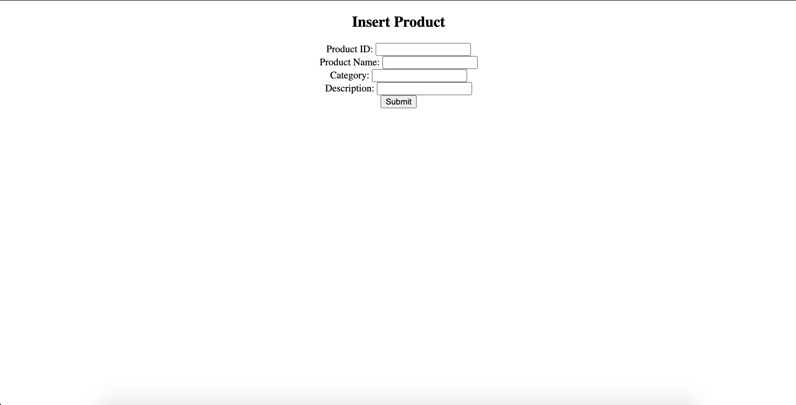
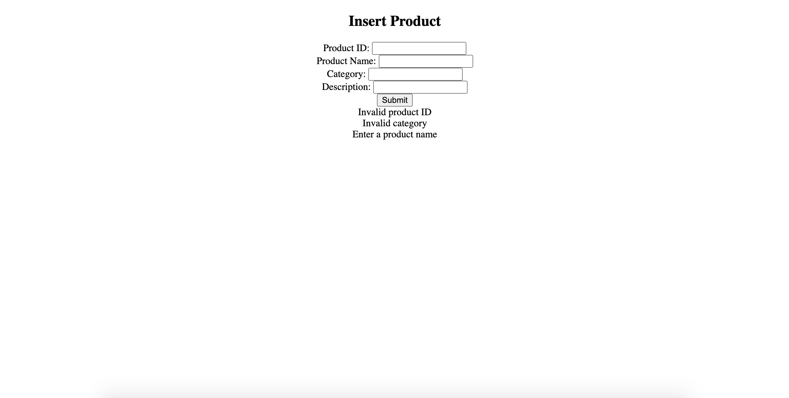
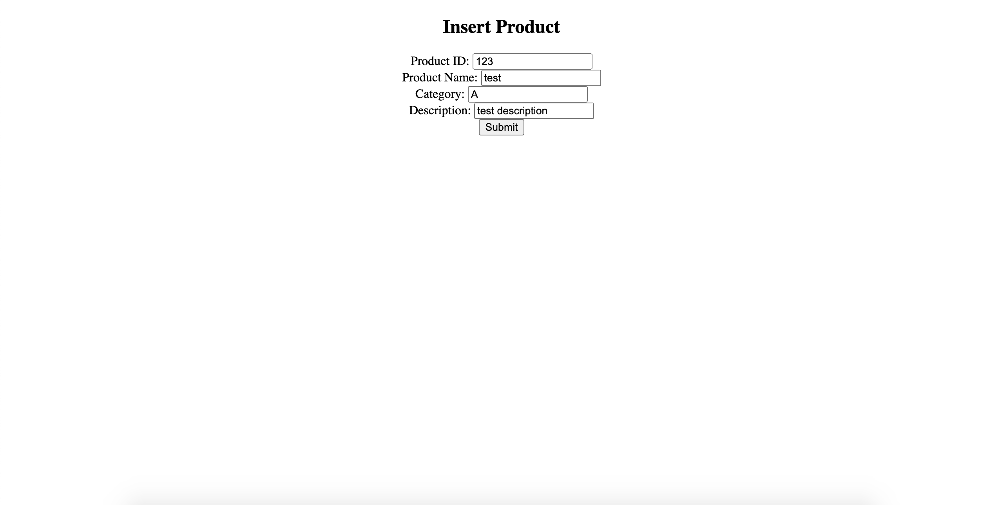
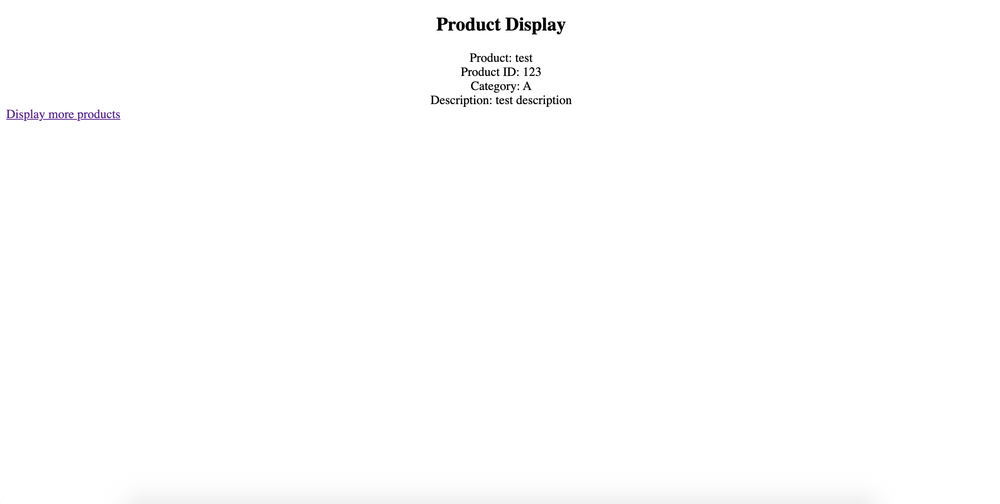

# Product Details Portal

This program is a servlet-based web application that shows a form to enter product details and redirects the user to a display page...

## Features

	- Basic product input form
	- Verifies user product input
	- On success redirects user to another page displaying product details
	- Appropriate error messages and redirection are executed upon clicking the submit button
	- Return to product input page from display page

## Installation

	- Clone and pull source code from provided github repository
	- Compile source code with Java Compiler
	- Run with Apache Tomcat server

## Code

https://github.com/salabha77/Product-Details-Portal.git

## Flow

1. Start by creating a 'Dynamic Web Project' in Eclipse

3. Create 2 packages, 'com.entity', and 'com.servlet'

4. Create 'Product' class inside 'com.entity' package

5. Create 'ProductController' servlets inside 'com.servlet' package

9. Define 'Product' class

11. Create 'index.jsp' and 'display.jsp' jsp pages

12. Inside 'index.jsp' implement working form and set action to 'ProductController'

13. Clear current session data 

13. Define 'ProductController' servlet

14. Inside 'ProductController' start an HTTPSession

15. Then check for all possible input errors

15. If input errors exist, redirect back to 'index.jsp' with error messages

16. If no input errors exist create product object with user input and set it into session and redirect to 'display.jsp'

17. Inside display.jsp retrieve user input from product object from session and implement display

18. Add a hyperlink to return back to 'index.jsp'

## Usage

	Once run, the webpage will ask user for product id, name, category, and description

User inputs incorrect product details (product id only accepts numeric characters, category accepts only alphabetical characters and max length of 5)
	
	User will be prompt with 'invalid product id', 'enter a product name', 'invalid category' messages
	Can trigger multiple error messages dependent on user input

User inputs correct credentials
	
	User will be redirect to product display page, displaying product details
	User can click 'Display more products' to return to product form page to display more product details

